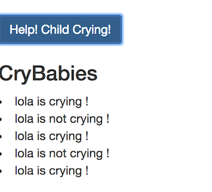

> Currently enrolled in <a href="https://www.udemy.com/the-complete-guide-to-angular-2" target="_blank">Udemy's- the complete guide to angular 2.</a> Notes from Lesson 5

## Output (Event) Binding
- enables the parent to listen for child events that is emitted (`EventEmitter`) via **output properties** denoted by `@Output()` decorator

- in the below example, when we toggle the 'Is Child Crying? button, it will display the name of the child and whether or not it is crying.
- The parent binds to the event `childrenCrying` and when the event is invoked, the `@Output` decorator in the `ChildComponent` named `childrenCrying` emits a notification to the parent. The parent then invokes the `onChildrenCrying($event)` event handler.




  **child.component.ts**
  
    ```
    @Component({
      selector: 'app-child',
      template: 
      `
        <button
        class="btn btn-primary"
        (click)="toggleChildCrying()">Is Child Crying?</button>
      `
    })

    export class ChildComponent implements OnInit {
      @Output() public childrenCrying = new EventEmitter<{name: string, cryingStatus: string}>();

      public children: {}[] = [];
      public cryingStatus: string = 'not crying';

      constructor() { }

      ngOnInit() {
      }

      toggleChildCrying() {
        this.cryingStatus = this.cryingStatus == 'not crying' ? 'crying' : 'not crying'
        this.childrenCrying.emit({
          name: 'lola',
          cryingStatus: this.cryingStatus
        });
      }
    }

    ```

  **parent.component.ts**

    ```
    @Component({
      selector: 'app-parent',
      template: 
      `
        <app-child
          (childrenCrying)="onChildrenCrying($event)">
        </app-child>

        <h3> CryBabies </h3>
        
        <li *ngFor="let child of childrenCryingList">{{ child.name }} is {{ child.cryingStatus }} !</li>

      `
    })

    export class ParentComponent implements OnInit {
      public childrenCryingList = [];
      
      constructor() { }

      ngOnInit() {
      }
      onChildrenCrying(child: {name: string, cryingStatus: string}) {
        this.childrenCryingList.push({name: child.name, cryingStatus: child.cryingStatus});
      }
    }
    ```


  **the above code displays:**



    


  ## Custom Event Binding
    - if you don't want to expose the property of the event that you are binding to, you can also use the   `@Output` decorator and use the output alias.

    - for example, referencing the same sample code above, in the child component, you can give the `childrenCrying` event emitter a named output decorator called `cryingEvent`. Thus in the parent component you bind to that event via the new name, which allows you to expose the property from the child component.  

  **child.component.ts**
  
    ```
    export class ChildComponent implements OnInit {
      @Output('cryingEvent') public childrenCrying = new EventEmitter<{name: string, cryingStatus: string}>();
    ```

  **parent.component.ts**

    ```
    @Component({
      selector: 'app-parent',
      template: 
      `
        <app-child
          (cryingEvent)="onChildrenCrying($event)">
        </app-child>

        <h3> CryBabies </h3>
        
        <li *ngFor="let child of childrenCryingList">{{ child.name }} is {{ child.cryingStatus }} !</li>

      `
    })
    ```
