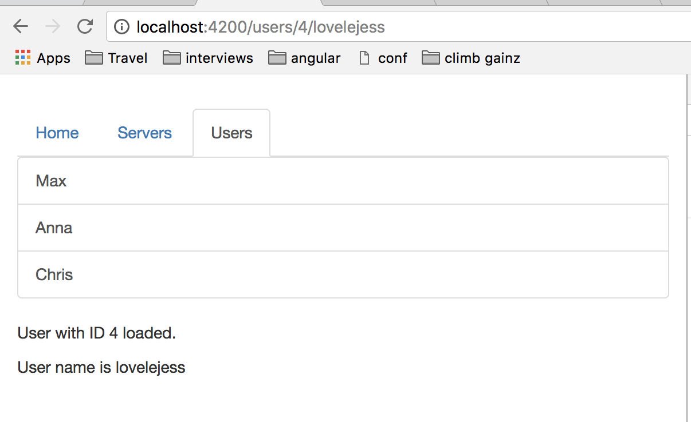

### Angular Routes
- Angular routes allows the user to navigate from one view to another via the browser's URL. 

### Angular Routes Configuration

- **app.module.ts**

    ```
    import { Routes, RouterModule } from '@angular/router';

    const appRoutes: Routes = [
    {path: '', component: HomeComponent},
    {path: 'users', component: UsersComponent},
    {path: 'servers', component: ServerComponent},
    ];

    imports:[
        RouterModule.forRoot(appRoutes)
    ]

    ```

### Angular Routes Consumption
- add the `<router-outlet></router-outlet>` as a placeholder for your routers component
- add the `routerLink` attribute and set it to one of the routes defined in `app.module.ts`


- **app.component.html**

    ```
    <div class="container">
        <div class="row">
            <div class="col-xs-12 col-sm-10 col-md-8 col-sm-offset-1 col-md-offset-2">
            <ul class="nav nav-tabs">
                <li role="presentation" class="active"><a routerLink="/">Home</a></li>
                <li role="presentation"><a routerLink="/servers">Servers</a></li>
                <li role="presentation"><a [routerLink]="['/users']">Users</a></li>
            </ul>
            </div>
        </div>
        <div class="row">
            <div class="col-xs-12 col-sm-10 col-md-8 col-sm-offset-1 col-md-offset-2">
            <router-outlet></router-outlet>
            </div>
        </div>
    </div>

    ```
    - the above code creates a tab navigation for:
        * Home => '/'
        * Servers => '/servers'
        * Users => '/users'


### Absolute Paths vs Relative Paths
- **absolute paths** are denoted by `/PATHNAME`
- **relative paths** are denoted by `"./PATHNAME"` or `"PATHNAME"` or `"../../../PATHNAME"` 

- routes defined in `app.module.ts` is preceeded by `localhost:4200/` or `yourdomain.com/`


### Parameterizing Routes
- denoted by `:`

- **app.module.ts**

    ```
    import { Routes, RouterModule } from '@angular/router';

    const appRoutes: Routes = [
    {path: '', component: HomeComponent},
    {path: 'users', component: UsersComponent},
    {path: 'users/:id/:name', component: UsersComponent},
    {path: 'servers', component: ServerComponent},
    ];

    imports:[
        RouterModule.forRoot(appRoutes)
    ]

    ```

- **user.component.ts**

    ```
    import { Component, OnInit } from '@angular/core';
    import { ActivatedRoute, Params } from '@angular/router';

    @Component({
    selector: 'app-user',
    templateUrl: './user.component.html',
    styleUrls: ['./user.component.css']
    })
    export class UserComponent implements OnInit {
        user: {id: number, name: string};

        constructor(private route: ActivatedRoute) { }

        ngOnInit() {
            this.user = {
            id: this.route.snapshot.params['id'],
            name: this.route.snapshot.params['name']
            };
        };
    }
    ```
- the `route.snapshot.params` takes a "snapshot" of the current route displayed in the browser via the params key defined in `Routes` in the `app.module.ts`. 

- **user.component.html**

    ```
    <p>User with ID {{ user.id }} loaded.</p>
    <p>User name is {{ user.name }}</p>
    ```

- in the above example, `'users/:id/:name'` is a parameterized path for users with a parameterized id and name.


    

### Routes as an Observable
- use the observable `Params` from `@angular/router` library to subscribe to the routes parameters being changed. 
- example:
    ```
    import { ActivatedRoute, Params } from '@angular/router';

    constructor(private route: ActivatedRoute) { }

    public ngOnInit(): void {
        this.route.params.subscribe((params: Params) => {
            this.user.id = params['id'],
            this.user.name = params['name']
        });
    }    
    ```