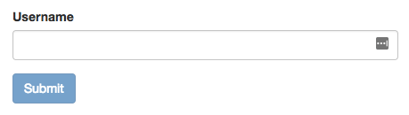
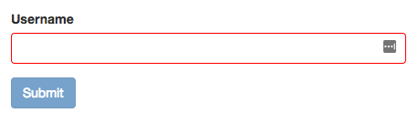
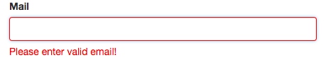
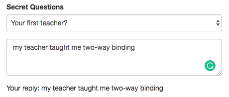

## Angular Forms
* Two Approaches to handling forms:
  * **Template-Driven**
    - angular infers the Form Object from the DOM
  * **Reactive**
    - Form is created programmatically and synchronized with the DOM


## Template-Driven Approach
- use the Angular directive, `<form></form>
- 
- **app.component.html**
  - form submission: 
    - `onSubmit` is method that is invoked when the event for `ngSubmit` is emitted (form is submitted)
      - Template Variable Example:  
        - `(ngSubmit)="onSubmit(subscriptionForm) #subscriptionForm="ngForm"`
    - `#subscriptionForm` binds to `ngForm` and is passed into the `onSubmit` method so that the method has access to the `ngForm` 
  
    ```
      <form (ngSubmit)="onSubmit(userNameForm)" #userNameForm="ngForm">
        <div class="form-group">
          <label for="userNameInput">Username</label>
          <input 
                  type="text"
                  id="username"
                  class="form-control"
                  ngModel
                  name="username"
                  required
                  >
        </div>
        <button 
              class="btn btn-primary"
              type="submit"
              [disabled]="userNameForm.invalid"
        > Submit
        </button>
      </form>
    ```

- **app.component.ts**

  ```
    import { Component } from '@angular/core';
    import { NgForm } from '@angular/forms';

    @Component({
      selector: 'app-root',
      templateUrl: './app.component.html',
      styleUrls: ['./app.component.css']
    })
    export class AppComponent {
      public onSubmit(userNameForm: NgForm): void {
        console.log(`form: ${userNameForm.value.username}`);
      }
    }
  ```

- or can use the `@ViewChild()` way:

- **app.component.html**
    ```
      <form (ngSubmit)="onSubmit()" #userNameForm="ngForm">
        <div class="form-group">
          <label for="userNameInput">Username</label>
          <input 
                  type="text"
                  id="username"
                  class="form-control"
                  ngModel
                  name="username"
                  required
                  >
        </div>
        <button 
              class="btn btn-primary"
              type="submit"
              [disabled]="userNameForm.invalid"
        > Submit
        </button>
      </form>
    ```

- **app.component.ts**

  ```
    import { Component } from '@angular/core';
    import { NgForm } from '@angular/forms';

    @Component({
      selector: 'app-root',
      templateUrl: './app.component.html',
      styleUrls: ['./app.component.css']
    })

    export class AppComponent {
      @ViewChild('userNameForm') userNameForm: NgForm;

      public onSubmit() {
        console.log(this.userNameForm.value.username);
      }
    }
  ```

- The above code generates this:




## Form Validation
- **required** input
  - invalidates form if input is missing
  - use keyword `required`

- **app.component.html**
  ```
   <form (ngSubmit)="onSubmit()" #userNameForm="ngForm">
        <div class="form-group">
          <label for="userNameInput">Username</label>
          <input 
                  type="text"
                  id="username"
                  class="form-control"
                  ngModel
                  name="username"
                  required
                  >
        </div>
        <button 
              class="btn btn-primary"
              type="submit"
              [disabled]="userNameForm.invalid"
              [ngClass]="{ 'input.ng-invalid' : !userNameForm.valid }">
        > Submit
        </button>
      </form>
  ```
- the `ngClass` styling above adds a red border around the invalid input boxes after they have been touched

- **app.component.css**
  ```
    input.ng-invalid.ng-touched {
      border: 1px solid red;
    }
  ```

- The above code generates this:




## Error Messages for Form Validation: One Way Binding
- bind to the `ngModel` via template binding:

- the below code will add a 'Please enter valid email' message right below the input box if the email is invalid and the input box has been touched.

- **app.component.html**
  ```
   <form (ngSubmit)="onSubmit()" #userNameForm="ngForm">
    <div class="form-group">
      <label for="email">Mail</label>
      <input
            type="email"
            id="email"
            class="form-control"
            ngModel
            name="email"
            required
            #email="ngModel"
      >
      <span class="help-block"
            *ngIf="!email.valid && email.touched">
            Please enter valid email!
      </span>
    </div>
  </form>
  ```

- The above code generates this:
  


## Default Values in Forms
- property bind to `ngModel` and add a `name` attribute

- **app.component.html**

  ```
    <div class="form-group">
        <label for="secret">Secret Questions</label>
        <select
              id="secret"
              class="form-control"
              [ngModel]="defaultQuestion"
              name="secret">
          <option value="pet">Your first Pet?</option>
          <option value="teacher">Your first teacher?</option>
        </select>
    </div>
  ```

- **app.component.ts**

  ```
    export class AppComponent {
      public defaultQuestion: String = "teacher";
    }
  ```

## Form Validation: Two Way Binding
- use two way binding to bind to the input answers

- **app.component.html**
  ```
    <div class="form-group">
      <label for="secret">Secret Questions</label>
      <select
            id="secret"
            class="form-control"
            [ngModel]="defaultQuestion"
            name="secret">
        <option value="pet">Your first Pet?</option>
        <option value="teacher">Your first teacher?</option>
      </select>
    </div>

    <div class="form-group">
      <textarea
        name="questionAnswer"
        rows="3"
        class="form-control"
        [(ngModel)]="questionAnswer">
      </textarea>
    </div>

    <p>Your reply: {{ questionAnswer }} </p>
  ```

- **app.component.ts**

  ```
    export class AppComponent {
      public questionAnswer: String = "";
    }

  ```
- The above code generates this:


