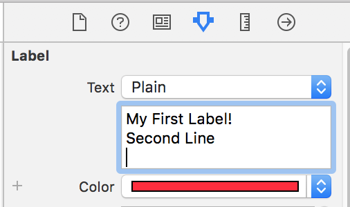
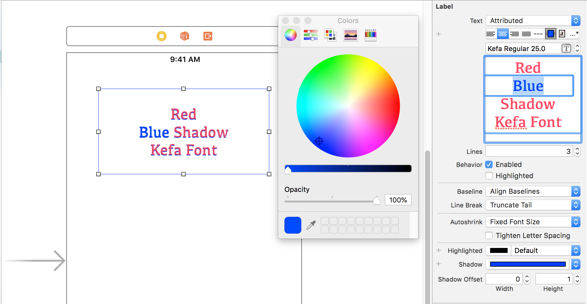

> Currently enrolled in <a href="https://www.udemy.com/complete-ios-11-developer-course" target="_blank">Udemy's- The Complete iOS 11 & Swift Developer Course</a> Notes from Lesson 1 and 2

## Getting Started with Swift4 and Xcode 9: Labels

### Cool Tricks:
  * **Add a new line in a label** by holding *option* key and pressing *enter* key in the xcode label editor!

  

  * **Edit sections of the label** by doing the following:
    * **Text:** Attributed
    * Highlight the section of the label -> Edit the color, font, size, alignment, etc. 

  

## Getting Started with Swift4 and Xcode 9: Interacting with Buttons

* **Types of Connections:** 
  * **Outlet** 
    * @property
    * Flow: Code -> User Interface
    * Used to change the content of a UI element with code
    * For example: when a View Controller needs to set the text of a UILabel, it would do so through the outlet connection.
  * **Action**
    * a function
    * Flow: User Interface -> Code
    * Used to create some code that will run when a button is tapped
    * Triggered when the object on the user interface is pressed

## Getting Started with Swift4 and Xcode 9: Images

### Cool Tricks & Tips:
  * Use an **image view**
  * Use Aspect Fit to keep the image true to size and it will fit it within the image view bounds
