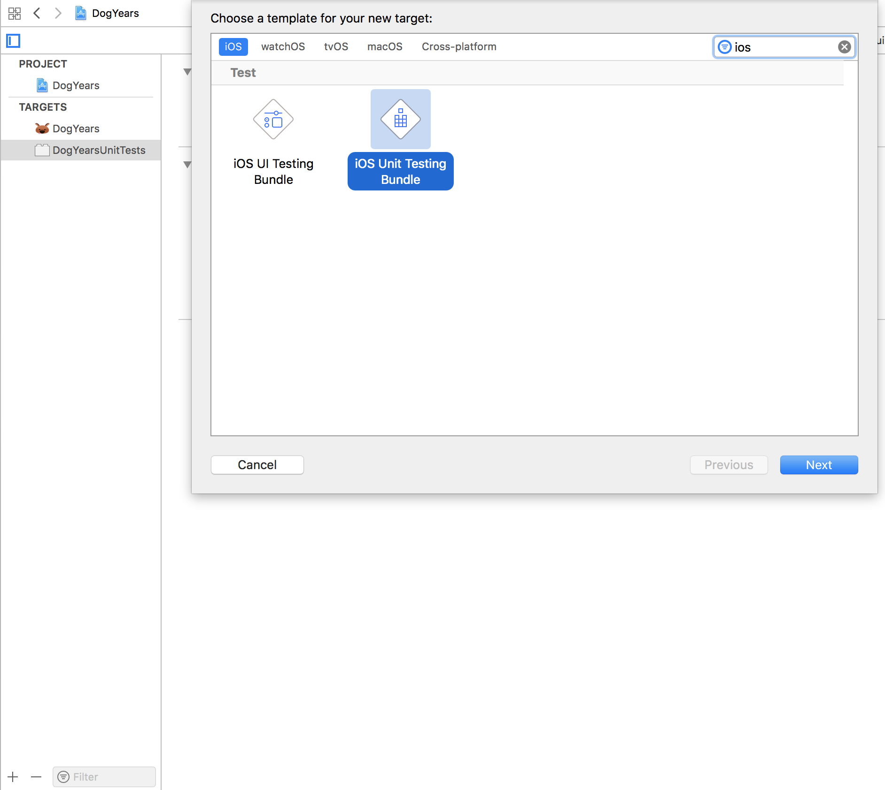
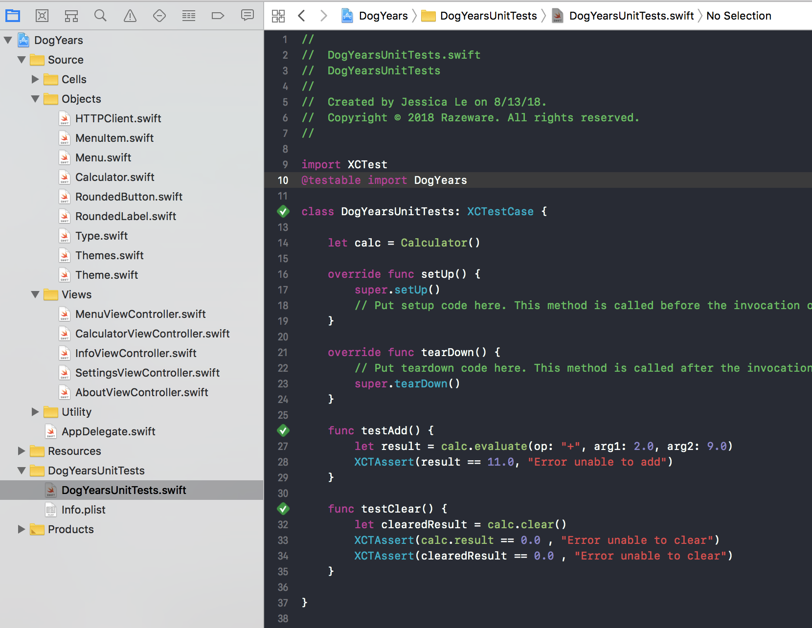

> Currently enrolled in <a href="https://www.raywenderlich.com/3530-testing-in-ios/" target="_blank">Ray Wenderlich's- Testing in iOS Course</a> Notes from Lesson 1 and 2


## Getting Started/Setting Up

### How to Set Up an iOS Unit Test Bundle:
  * Add new iOS Unit Testing Bundle Target
    * This will create a new folder with your unit test files

  

  * Import your production code module at the top of your test file
    * `@testable import MyModule`

    
  * Write your tests! 
    * Preceed all unit tests with `testMyTestName()`

    ### Sample Test Code:

    ```
    import XCTest
    @testable import DogYears

    class DogYearsUnitTests: XCTestCase {
        
        let calc = Calculator()
        
        override func setUp() {
            super.setUp()
            // Put setup code here. This method is called before the invocation of each test method in the class.
        }
        
        override func tearDown() {
            // Put teardown code here. This method is called after the invocation of each test method in the class.
            super.tearDown()
        }
        
        func testAdd() {
            let result = calc.evaluate(op: "+", arg1: 2.0, arg2: 9.0)
            XCTAssert(result == 11.0, "Error: Add result does not equal 11.0")
        }
        
        func testClear() {
            let clearedResult = calc.clear()
            XCTAssert(calc.result == 0.0 , "Error: Clear result does not equal 0.0")
            XCTAssert(clearedResult == 0.0 , "Error: Return clear result does not equal 11.0")
        }
        
    }
    ```