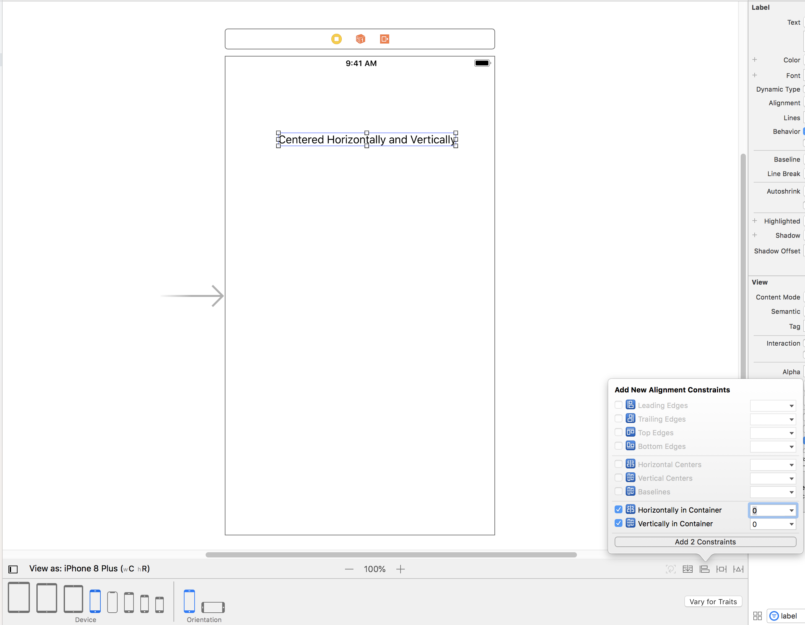
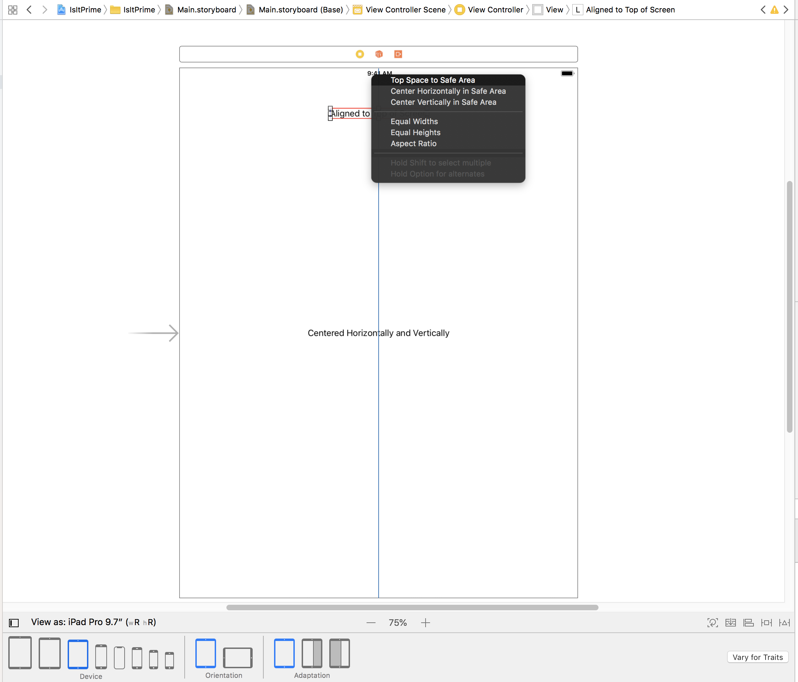
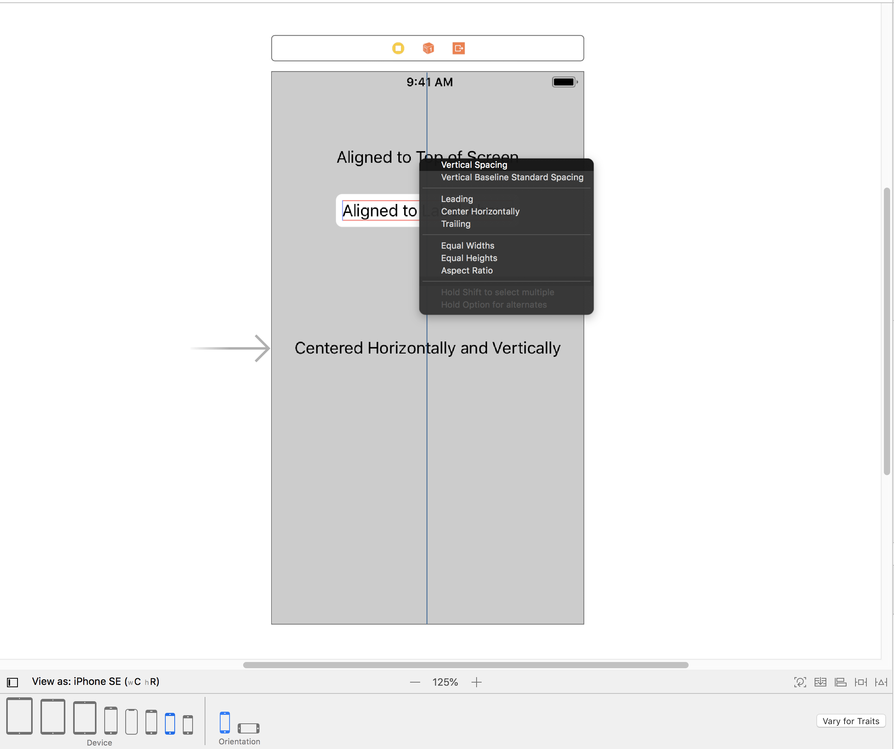
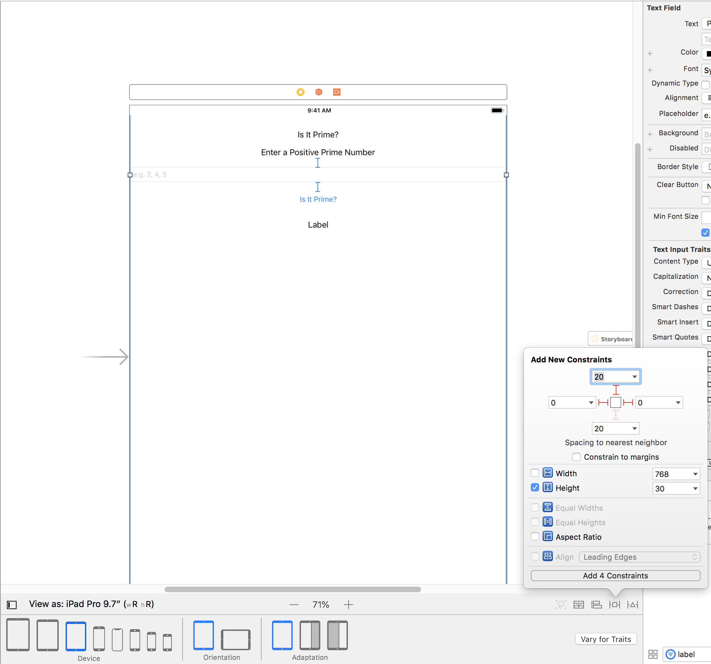

> Currently enrolled in <a href="https://www.udemy.com/complete-ios-11-developer-course" target="_blank">Udemy's- The Complete iOS 11 & Swift Developer Course</a> Notes from Lesson 4

## Auto Layout
* Auto layout is a cool functionality that assists you in dynamically sizing your ui components' positions on a view based on the constraints you place on it

## Cool Tricks/ Tips:
* If you notice any red lines on your layouts, then it indicates that your layout may have conflicting postions. Make sure they're blue  so that it's pretty for all devices!

## How to Center a UI Label
* Let's add an UI label that is positioned both vertically and horizontally for ALL iOS devices.

* Add a label and then click on the **align** button (icon has two stacked rectangles) at the bottom right hand corner of your screen
* In "Add New Alignment Contraints" > Check both boxes for:
  * Horizontally in Container
  * Vertically in Container

  
  
* Now navigate to all the different devices and notice that they are automatically centered for all devices! How cool! 

## How to Align Label at Top of Screen
* Add a label and then click on the **align** button (icon has two stacked rectangles) at the bottom right hand corner of your screen
* In "Add New Alignment Contraints" > Check the box for:
  * Horizontally in Container
* Now we need to align it vertically, so control click on the label drag your cursor to the top of the view and select *"top space to safe area"*

   

## How to Align Label Relative to Another Label
* Add a label and then click on the **align** button (icon has two stacked rectangles) at the bottom right hand corner of your screen
* In "Add New Alignment Contraints" > Check the box for:
  * Horizontally in Container
* Now we need to align it vertically, so control click on the label drag your cursor to the the above label and select *"Vertical Spacing"*

   

## Add New Constraints 
* Can use the **Add New Constraints** icon to add constraints relative to its neighbor as well
* Below, we add constraints for the left, right, and top constraints and a set height of the text field
  
  

