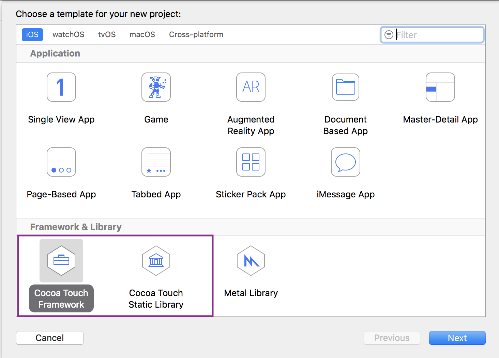
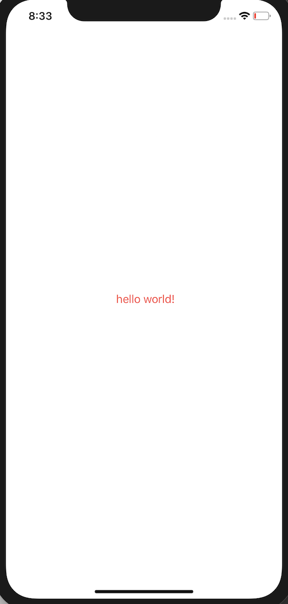
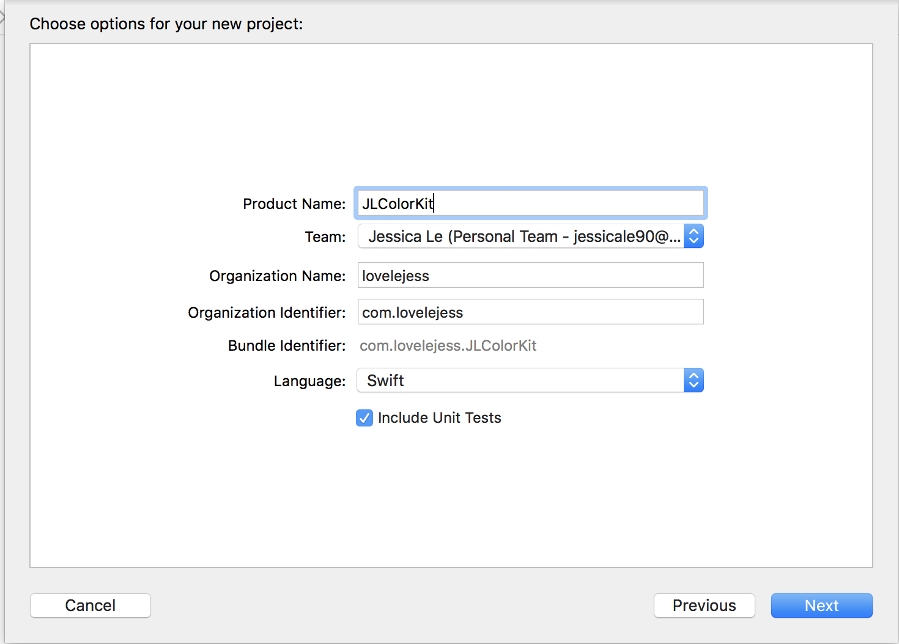
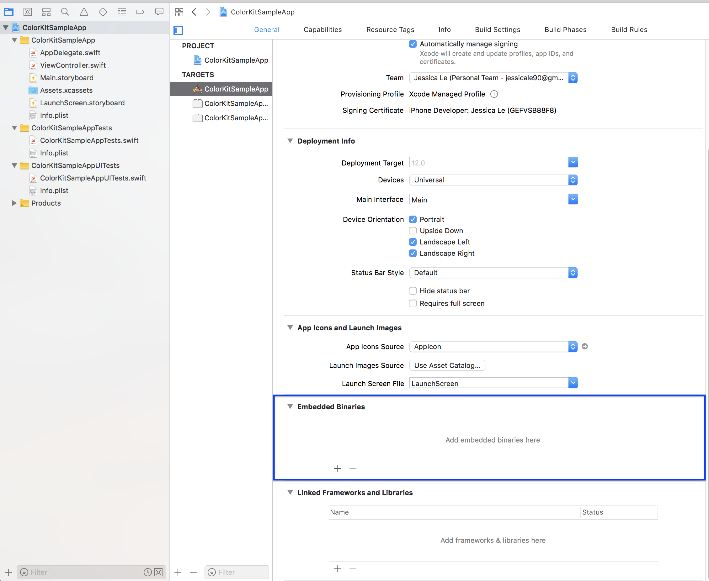
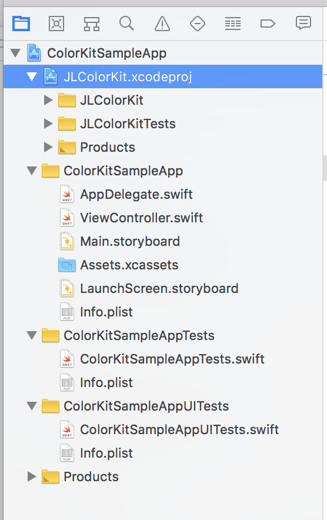
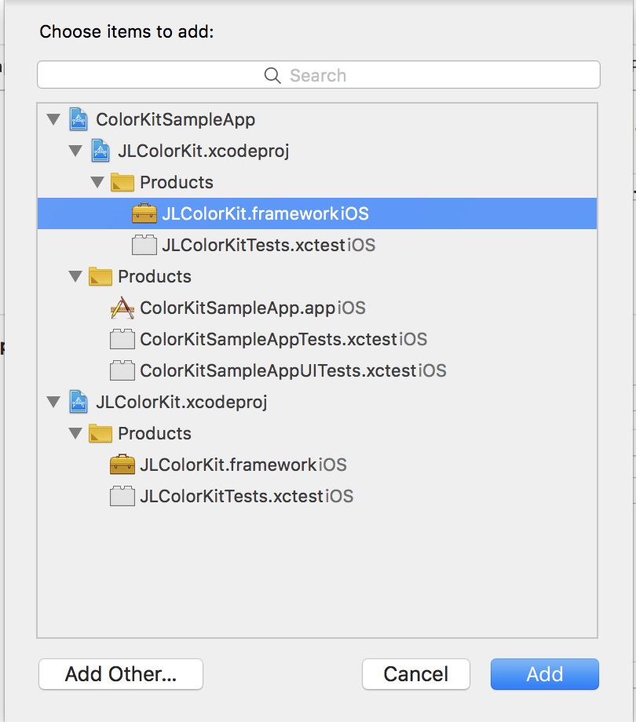

## Intro - Why Create Custom Libaries for iOS
Custom Libraries are great for when you have chunks of reusable code that you want easily shared across multiple code bases. If you make a change in this custom library, then all your code bases consuming this library can receive the new updates. This is a great way to keep your code DRY (Don't Repeat Yourself), encapsulate your code by only exposing the higher level details, and enables you to share your awesome code with other developers!

There are two ways that you can create a custom library for iOS: **Cocoa Touch Framework** or **Cocoa Touch Static Library**, and they each serve different purposes. 

  

## Cocoa Touch Framework
* A **Cocoa Touch Framework** is the newer shareable resource that only supports **iOS 8+**, thus can be written in **Swift**.
* The framework **calls** your application. aka **inversion of control**. Think of Javascript frameworks such as Angular, React, etc. Those are frameworks that you use and you write code to fit their syntax. Apple uses the terminology [framework](https://developer.apple.com/documentation/) for all of their reusable and modular code. 

## Cocoa Touch Static Library
* A **Cocoa Touch Static Library** is a collection of compiled files that are copied and packaged up and then linked to your application's executable binary. The static library is essentially a copy of the code embedded in the application that is consuming it. This can result in a large application size.
* It only supports **iOS 6+**, so if you need to support older versions, this is the one you should use. However this library must be written in **Objective C**.
* Your application **uses** the library. Think of Node libraries. You pull in those libraries to use in your application.

## Creating Your Custom Libary
* We will go through the following steps: 
  1. Create a **Cocoa Touch Framework** 
    * In Xcode: `File > New > Project > Cocoa Touch Framework`
    * Name your Library with the appropriate Team, Organization Name, and Organization Identifier
    * Select `Swift` as your language 
  1. Create a new Swift class file to add to your library
  1. Embed the library in your application
  1. Use your custom library in your application
  1. Run your application!

## Walkthrough
* We're going to create a hello world application that will display a custom color from our library. It will look like this: 



### Create a **Cocoa Touch Framework** 
  * In Xcode: `File > New > Project > Cocoa Touch Framework`
  * Name your Library `JLColorKit` with the appropriate Team, Organization Name, and Organization Identifier
  * Select `Swift` as your language 

  


### Create a new Swift class file to add to your library
* In `JLColorKit` group/folder, add a new file:
  * Right click on `JLColorKit` > New File... > Swift Class
  * Name it `TrueColors`
* Add replace the entire contents of that file with the following block of code:

```
import UIKit

public extension UIColor {
    public struct DarkColor {
        public static let CuriousRed = UIColor(red:1.00, green:0.30, blue:0.29, alpha:1.0)
    }
}
```
* Build it!

### Embed the library in your application
* First make sure you close your library. I found that it creates weirdness in XCode when importing the library.
* Create a new Single View Application. I named mine: `ColorKitSampleApp`
* In your app's target in the `General` tab, scroll down to `Embedded Binaries`
 
* Click the plus sign (+) > Add Other > <LOCATION_TO_YOUR_COLOR_KIT_LIBRARY.xcodeproj>
  * This should add the `JLColorKit` .xcodeproj underneath `ColorKitSampleApp`. You'll see all your source code here. It's like it copied and pasted it here. 

  

  * Now we need to add the Embedded Binaries so that it can link and build the `JLColorKit` library.
  * Go to your SampleApp's `Embedded Binaries` again and click the plus sign. You know should see `JLColorKIt` as one of your options, so select that. It will add the `JLColorKit.framework` to your embedded binaries. Build it!

  


### Use your custom library in your application
* Navigate to the `Main.storyboard` and add a label named: `helloWorldLabel`. 
* Navigate to your `ViewController.swift` and don't forget to add an `@IBOutlet`!
  * Add `import JLColorKit` to the top of your file 
  * In `viewDidLoad()` method add `helloWorldLabel.textColor = UIColor.DarkColor.CuriousRed;`
* Your code will look like so: 

  ```
  import UIKit
  import JLColorKit

  class ViewController: UIViewController {
      @IBOutlet weak var helloWorldLabel: UILabel!
      override func viewDidLoad() {
          super.viewDidLoad()
          helloWorldLabel.textColor = UIColor.DarkColor.CuriousRed;
      }
  }
  ````
* Run it and you will see your app using your new custom color!

#### Next Up: How to Make a CocoaPod!