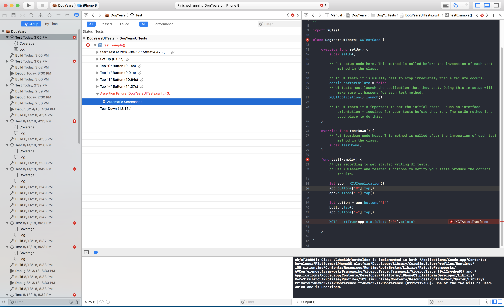
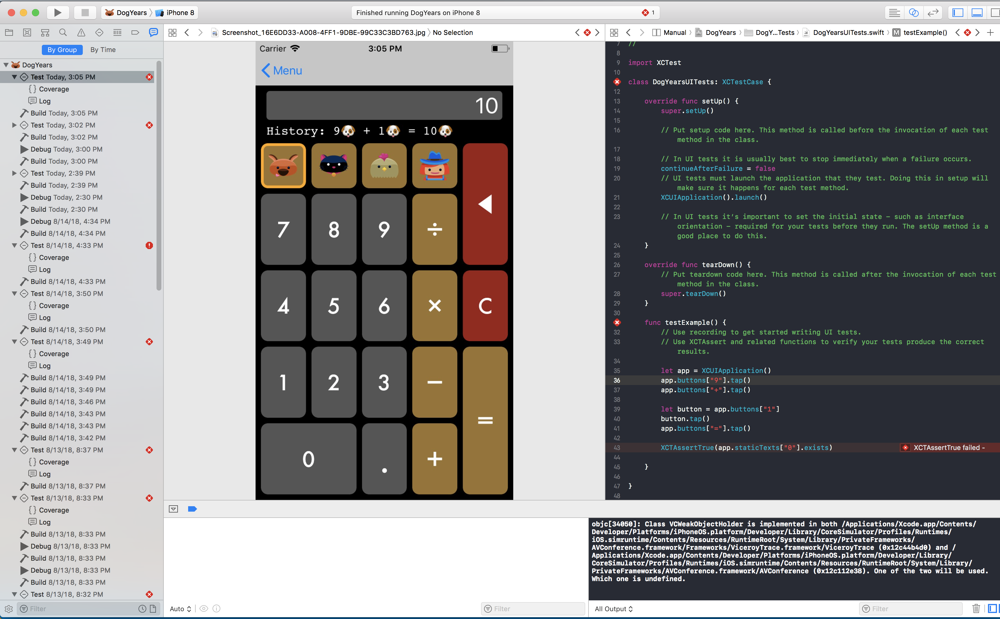

> Currently enrolled in <a href="https://www.raywenderlich.com/3530-testing-in-ios/" target="_blank">Ray Wenderlich's- Testing in iOS Course</a> Notes from Lesson 21-29

 * iOS UI Test Recordings are super neat! It records your every move in the simulator and translates it into code for you. All you have to do is write the assertion! Here's how to get started:

## Getting Started/Setting Up

### How to Set Up an iOS UI Test Bundle:
  * Add new iOS UI Testing Bundle Target
    * This will create a new folder with your UI test files

  

  * Add a test method preceeded with the word `test`
  * Move your cursor within that function
  * Start recording your UI unit tests by: 
    * Have your selected simulator running
    * Click on the red circle record button to begin recording, like so:

  * When you're done recording, hit the button again and watch it populate your screen with code
  * Write your assertion based on what you recorded!

### Running Your UI Tests:

* Run the UI tests the same way as you would for a unit test
* If a test fails, the default behavior is to take a screenshot of the simulator at each step of the test. It's a great way for debugging
* To find the screenshots and ui test logs:
  * Navigate to the "Report Navigator" (Far right Icon in your left navigation panel)
  * Expand the most recent test run
    * You will see all the steps and the attached screenshots

  * If you look closely, you can see that I wrote my expectation wrong. The result should be 10, and not 0 since `9 + 1 = 10`. Oops, let's change that to make our test pass!