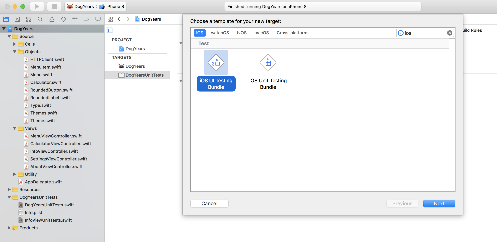
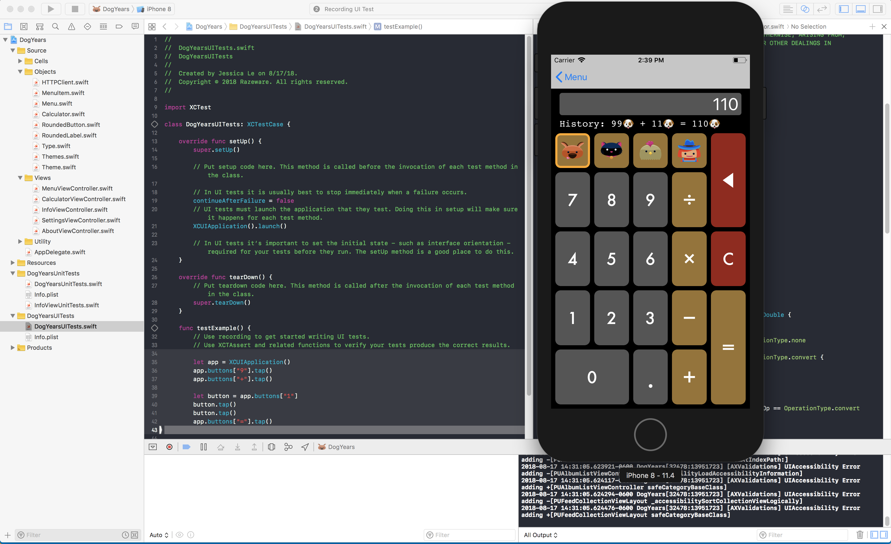

> Currently enrolled in <a href="https://www.raywenderlich.com/3530-testing-in-ios/" target="_blank">Ray Wenderlich's- Testing in iOS Course</a> Notes from Lesson 21-29

 * iOS UI Test Recordings are super neat! It records your every move in the simulator and translates it into code for you. All you have to do is write the assertion! Here's how to get started:

## Getting Started/Setting Up

### How to Set Up an iOS UI Test Bundle:
  * Add new iOS UI Testing Bundle Target
    * This will create a new folder with your UI test files

  

  * Add a test method preceeded with the word `test`
  * Move your cursor within that function
  * Start recording your UI unit tests by: 
    * Have your selected simulator running
    * Click on the red circle record button to begin recording, like so:

  * When you're done recording, hit the button again and watch it populate your screen with code
  * Write your assertion based on what you recorded! 
