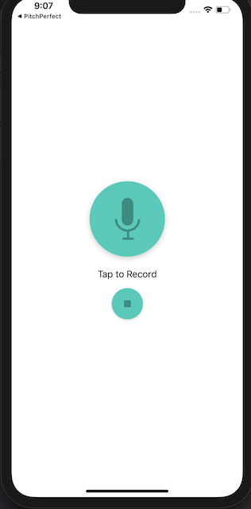
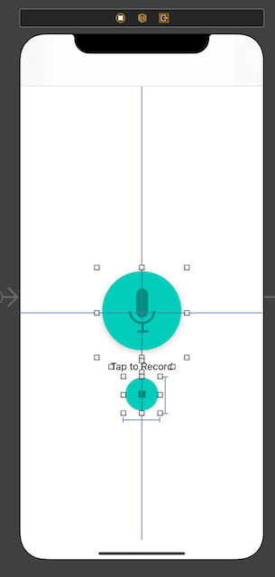
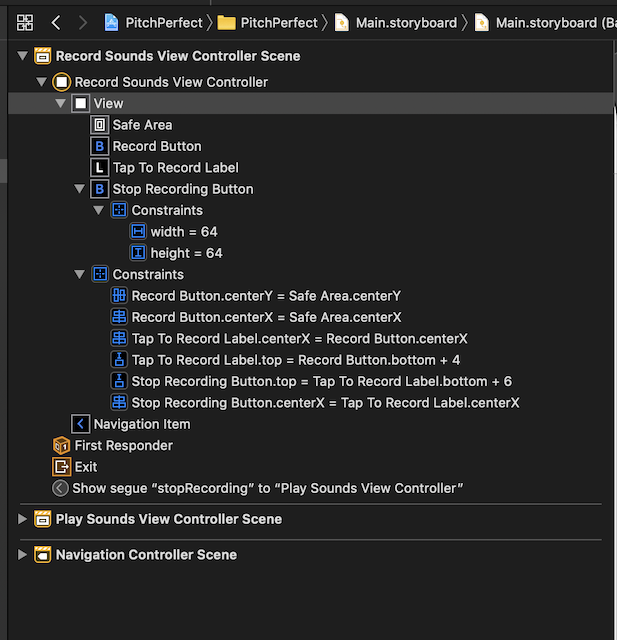

## SwiftUI vs Traditional UIKit Components

### SwiftUI:
- declarative
    - define by `UIView` hierarchies with reusable components  
- everything is contained within a `UIView`
- data driven
    - no need for `ViewController`

### UIKit
- imperative
    - strict, explicit user interfaces
    - defined `UIView` relationships
    - defined autolayout constraints
- tightly coupled to a `ViewController`

## SwiftUI vs Storyboards vs Programmatic UIKit

### Storyboards

#### Pros:

- what you see is what you get editor
- UI changes are updated immediately
- drag and drop components
- no code, `XML` is autogenerated

#### Cons:

- difficult to debug
- merge conflicts
- difficult to visualize UI in pull/merge requests
- failure to connect `IBOutlet`s fail at runtime, not at compile time

### Programmatic UI

#### Pros:
- ability to create reusable components
- ability to debug
- easier to merge and avoid hard to read merge conflicts
- different ways to set autolayout constraints:
    - Visual Format Language
    - NSLayoutConstraints
    - NSLayoutAnchor

#### Cons:
- no what you see is what you get editor
- UI changes are NOT updated immediately

### SwiftUI

#### Pros:
- no need to worry about setting autolayout constraints - it does it for you!
- enables devs to write less UI code and focus more on business logic
- much much less UI code
- automatically handles dark mode

#### Cons:
- still new, lots of kinks and bugs not worked out
- does a lot of "magic" since it infers layouts and size based on declared layouts and the device its displayed on


## SwiftUI vs Storyboard UIKit vs Programmatic in comparison

### SwiftUI

```
struct ContentView: View {
    var body: some View {
        VStack(spacing: 10) {
            Button(action: {
                print("RecordButton button tapped!")
            }) {
                Image("RecordButton").renderingMode(.original)
            }

            Text("Tap to Record")

            Button(action: {
                print("Stop button tapped!")
            }) {
                Image("Stop").renderingMode(.original)
                .resizable()
                .frame(width: 64, height: 64)
            }
        }
    }
}
```

#### Result:



### Storyboard UIKit

#### Main.storyboard:






#### Result:


### Programmatic

