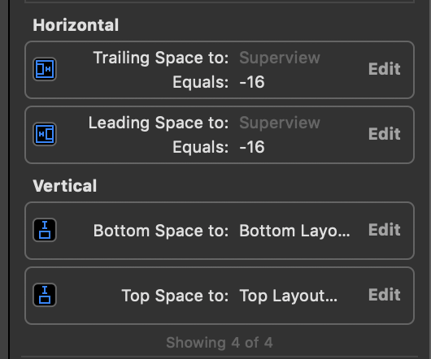
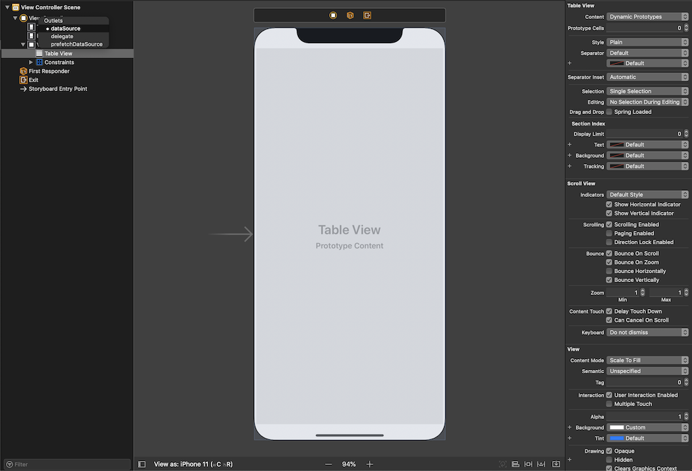
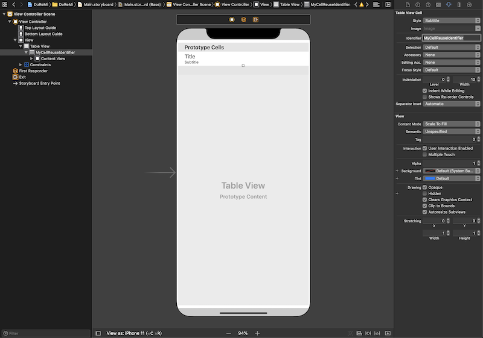
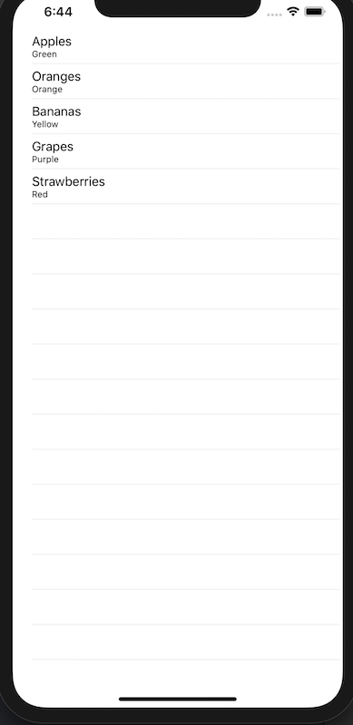

A **table view** contains groups of rows known as **table view cells** that display data on each of those individual rows. They can be used to display hierarchical data, which can be used in conjunction with **navigation views** to allow further digging.

A **table view** has two delegates: `UITableViewDataSource` and  `UITableViewDelegate`. The `UITableViewDataSource` is used to manage the table view's data, whereas the `UITableViewDelegate` is used to manage interactions with the table view.

Below is a simple example of creating a table view within a view controller.

### Simple TableViewController

#### ViewController + UITableViewDataSource
    //
    //  ViewController.swift
    //  SampleTableView
    //
    //  Created by Jessica Le on 01/10/20.
    //  Copyright (c) 2014 lovelejess. All rights reserved.
    //

    import UIKit

    // MARK: - ViewController: UIViewController, UITableViewDataSource

    class ViewController: UIViewController, UITableViewDataSource {
        
        // MARK: Properties
        
        // Use this string property as your reuse identifier, 
        // Storyboard has been set up for you using this String.
        let cellReuseIdentifier = "MyCellReuseIdentifier"
        
        // Choose some data to show in your table
        
        let model = [
            ["text" : "Apples", "detail" : "Green"],
            ["text" : "Oranges", "detail" : "Orange"],
            ["text" : "Bananas", "detail" : "Yellow"],
            ["text" : "Grapes", "detail" : "Purple"],
            ["text" : "Strawberries", "detail" : "Red"],
        ]
        
        // MARK: UITableViewDataSource
        
        // Add the two essential table data source methods here
        
        func tableView(_ tableView: UITableView, numberOfRowsInSection section: Int) -> Int {
            return self.model.count;
        }
        
        func tableView(_ tableView: UITableView, cellForRowAt indexPath: IndexPath) -> UITableViewCell {
            let cell =  tableView.dequeueReusableCell(withIdentifier: self.cellReuseIdentifier)!
            
            let dictionary = self.model[(indexPath as NSIndexPath).row]
            
            cell.textLabel?.text = dictionary["text"]
            cell.detailTextLabel?.text = dictionary["detail"]
            
            return cell
        }
    }

#### Main.storyboard

1. Add `TableView` to `View`

      

    * Add the constraints

        

    * Connect the `TableView`s `dataSource` property to the `view` 

        

1. Create a prototype cell via `TableViewCell`
    * **Style:** Subtitle
    * **Identifier:** MyCellReuseIdentifier

         

### Result

  