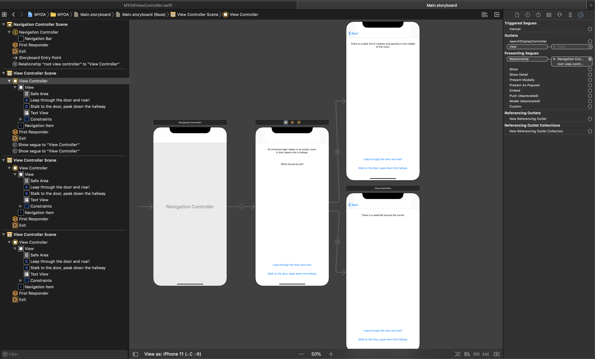

### How to Create a Navigation View

1. Add a `UINavigationController` into the storyboard from the object library. 
    1. Make sure to set it as your Initial View Controller
    1. If you don't want to use the automatically generated `RootViewController`, then delete it and create another `ViewController` of your choosing
        1. To reset the Navigation Controller’s Root View Controller property control click on the Navigation Controller’s round yellow icon and drag a line from the root view controller triggered segue to your new view controller or set Relationship Segue from Navigation Controller to new View Controller as `root view controller`
    1. Add more View Controllers to your stack by adding more segues via buttons or other actions.
    1. Repeat!

    
     

### How to Add Navigation Items

Each View Controller that is embedded in a `UINavigationController` has an optional reference to the `UINavigationController` object. Within the `UINavigationController`, exists a `navigationItem` property, which is used to access the items in the naviagiation bar. A navigation flow uses a stack (last in, first out) to manage its views. Therefore a view is pushed (added on top of another view) or popped (removed from the top) to flow from one view to another.

#### Code Sample:

##### Pushing View Controllers

    if let navigationController = navigationController {
            let viewController = self.storyboard!.instantiateViewController(withIdentifier: "ViewController") as! ViewController
            navigationController.pushViewController(viewController, animated: true)
        }

##### Pop to Root View Controller

    let _ = navigationController?.popToRootViewController(animated: true)

View controllers are deinitialized when they are popped off the navigation stack.

