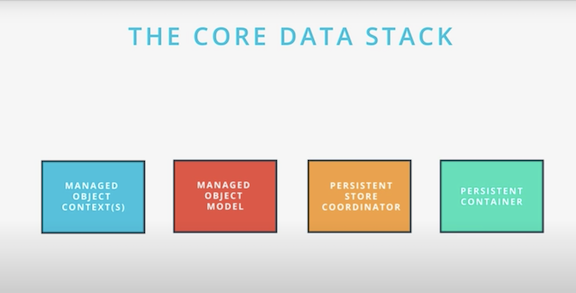
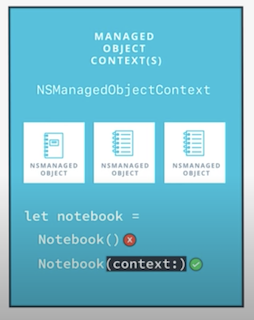
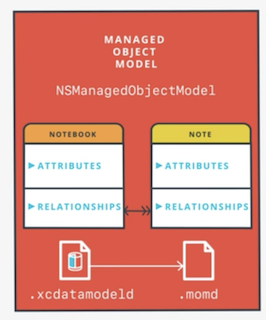
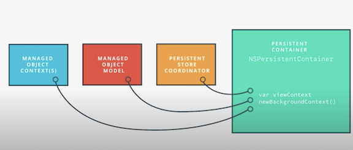

## Core Data Stack



### Managed Object Context
* `NSManagedObjectContext`
* an intelligent scratch pad for working with managed objects
* associate or register it with a context. Never instantiate directly



### Managed Object Model
* `NSManagedObjectModel`
* a description of the app's data, including entities, attributes, relationships, and class mappings



### Persistent Store Coordinator
* `NSPersistenceStoreCoordinator`
* a mediator for turning persisted data into managed objects and turning managed objects into persisted data
* interfaces with the underlying persistent store, such as SQL, so we don't have to
    
### Persistent Container
* `NSPersistentContainer`
* a helper that handles creation of the stack, and provides convenience methods



## Fetch Requests, Faults, and Uniquing

### Fetch Requests

* An NSFetchRequest specifies the criteria needed to select and optionally sort a group of managed objects held in a persistent store.

* Do not want to fetch all the data at once. Ideal to make multiple requests to get the data you need because iOS devices have finite memory, apps can have a lot of data, and fetch requests help limit your app’s data consumption. 
* A finely-tuned fetch request means we’ll only use the minimum memory required to display content to the user. 

### Faults

* Relationships are not immediately loaded. Instead, Core Data has a mechanism called faulting. Faulting allows any attribute or relationship to be in a special state where it is promised to load when needed. When you fetch a managed object, its relationships are initially represented as faults.
* Core Data automatically retrieves the data either from a cache or from the persistent store


### Uniquing

* Allows you to avoid reload the same object in the object belongs in several different object graphs/ relationships.
    * Example: a song can belong to multiple playlists


### Code Examples


You have an `NSManagedObject` subclass named `Animal`, and an `NSManagedObjectContext` in a local variable called `context`. Create a new managed object and save it in the persistent store.

```
class DataController {
    let persistentContainer: NSPersistentContainer
    
    var viewContext: NSManagedObjectContext {
        return persistentContainer.viewContext
    }
    
    init(modelName: String) {
        persistentContainer = NSPersistentContainer(name: modelName)
    }
    
    func load(completion: (() -> Void)? = nil) {
        persistentContainer.loadPersistentStores { (storeDescription, error) in
            guard error == nil else {
                fatalError(error!.localizedDescription)
            }
            self.autoSaveContext()
            completion?()
        }
    }
}

```

### Inject DataController `AppDelegate.swift`

```

let dataController = DataController(modelName: "Animals")

func application(_ application: UIApplication, didFinishLaunchingWithOptions launchOptions: [UIApplication.LaunchOptionsKey: Any]?) -> Bool {
    dataController.load()
    
    let navigationController = window?.rootViewController as! UINavigationController
    let animalsViewController = navigationController.topViewController as! AnimalsViewController
    animalsViewController.dataController = dataController
    return true
}
```


### Load Data via Fetch Requests

```
let fetchRequest: NSFetchRequest<Animal> = Animal.fetchRequest()
let sortDescriptor = NSSortDescriptor(key: "birthDate", ascending: false)
fetchRequest.sortDescriptors = [sortDescriptor]

if let result = try? dataController.viewContext.fetch(fetchRequest) {
    aniamls = result
    tableView.reloadData()
}
```


### Add a new animal to the end of the `animals` array

```
func addAnimal(name: String) {
    let animal =  Animal(context: dataController.viewContext)
    animal.name = name
    animal.birthDate = Date()
    try? dataController.viewContext.save()
    animals.insert(animal, at: 0)
    tableView.insertRows(at: [IndexPath(row: 0, section: 0)], with: .fade)
}
```

### Delete a new animal to the end of the `animals` array

```
/// Deletes the animal at the specified index path
func deleteAnimal(at indexPath: IndexPath) {
    let animalToDelete = animal(at: indexPath)
    dataController.viewContext.delete(animalToDelete)
    try? dataController.viewContext.save()
    animals.remove(at: indexPath.row)
    tableView.deleteRows(at: [indexPath], with: .fade)
}
```